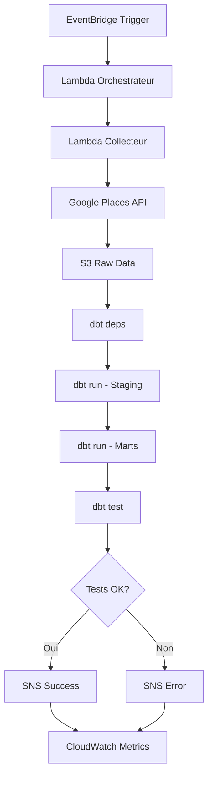

# 🤖 Orchestration AWS - Pipeline Automatique

## 📋 Description

Ce système d'orchestration automatise votre pipeline de données :
**Ingestion → dbt → NLP → Notifications**

### 🏗️ Architecture

```
EventBridge (Cron) → Lambda Orchestrateur → Lambda Collecteur
                                          ↓
                                       dbt Run
                                          ↓
                                    Tests Qualité
                                          ↓
                                    SNS Notifications
```

## 🚀 Déploiement Rapide

### 1. Prérequis
```bash
# Installer AWS CLI
pip install awscli

# Configurer AWS
aws configure
```

### 2. Déployer
```bash
cd orchestration
./deploy.sh
```

Le script vous demandera :
- 🔑 **Clé API Google Places**
- 📧 **Email pour notifications**

### 3. Confirmation
- Confirmez l'abonnement SNS dans votre email
- Le pipeline s'exécute automatiquement **tous les jours à 8h UTC**

## 🔧 Composants

### 📦 **Lambda Orchestrateur** (`lambda_orchestrator.py`)
- **Rôle** : Coordonne tout le pipeline
- **Étapes** :
  1. Déclenche la collecte de données
  2. Lance les transformations dbt
  3. Exécute les tests de qualité
  4. Envoie les notifications

### 📥 **Lambda Collecteur** (`lambda_collector.py`)
- **Rôle** : Collecte les données depuis Google Places API
- **Sortie** : Données brutes vers S3

### ⏰ **EventBridge Schedule**
- **Fréquence** : Quotidienne à 8h UTC
- **Déclencheur** : Automatique

### 📧 **SNS Notifications**
- **Succès** : Résumé du pipeline
- **Échec** : Détails de l'erreur

## 📊 Monitoring

### CloudWatch Dashboard
- Métriques des Lambda
- Durées d'exécution
- Taux d'erreur

### Logs
```bash
# Logs orchestrateur
aws logs tail /aws/lambda/restaurant-pipeline-orchestrator --follow

# Logs collecteur
aws logs tail /aws/lambda/restaurant-pipeline-data-collector --follow
```

## 🎯 Utilisation

### Déclencher Manuellement
```bash
# Via AWS CLI
aws lambda invoke \
    --function-name restaurant-pipeline-orchestrator \
    --payload '{"trigger_source":"manual"}' \
    response.json

# Via Console AWS
# Lambda → Fonctions → restaurant-pipeline-orchestrator → Test
```

### Modifier la Planification
Éditez dans `cloudformation_template.yaml` :
```yaml
ScheduleExpression: 'cron(0 8 * * ? *)'  # Quotidien 8h
# ou
ScheduleExpression: 'rate(12 hours)'     # Toutes les 12h
```

## 🛠️ Configuration

### Variables d'Environnement Lambda
- `GOOGLE_PLACES_API_KEY` : Clé API Google
- `S3_BUCKET_NAME` : Bucket de données
- `SNS_TOPIC_ARN` : Topic notifications

### Paramètres Modifiables
```python
# Dans lambda_collector.py
max_restaurants = 20  # Nombre de restaurants
target_city = "Paris"  # Ville cible

# Dans lambda_orchestrator.py
timeout = 300  # Timeout par étape (secondes)
```

## 🚨 Gestion d'Erreurs

### Types d'Erreurs
1. **Erreur API** : Quota dépassé, clé invalide
2. **Erreur dbt** : Problème de transformation
3. **Erreur Tests** : Données incohérentes

### Actions Automatiques
- **Retry** : 3 tentatives automatiques
- **Notification** : Email d'alerte immédiate
- **Logs** : Détails dans CloudWatch

### Résolution
```bash
# Vérifier les logs
aws logs describe-log-groups --log-group-name-prefix "/aws/lambda/restaurant-pipeline"

# Relancer manuellement
aws lambda invoke --function-name restaurant-pipeline-orchestrator response.json
```

## 💰 Coûts AWS (Estimation)

### Quotidien (20 restaurants)
- **Lambda** : ~0.01$ (100ms d'exécution)
- **S3** : ~0.001$ (quelques MB)
- **SNS** : ~0.0001$ (1 notification)
- **EventBridge** : Gratuit (1 règle)

### **Total mensuel : ~0.30$** 

## 🔄 Pipeline Flow Détaillé



## 🆘 Support

### Problèmes Courants

1. **"Function not found"**
   ```bash
   # Vérifier le déploiement
   aws cloudformation describe-stacks --stack-name restaurant-pipeline-orchestration
   ```

2. **"Access Denied"**
   ```bash
   # Vérifier les permissions IAM
   aws iam get-role --role-name restaurant-pipeline-lambda-role
   ```

3. **"Timeout"**
   - Augmenter le timeout Lambda (max 15 min)
   - Ou migrer dbt vers ECS/Fargate

### Commandes Utiles
```bash
# Status de la stack
aws cloudformation describe-stacks --stack-name restaurant-pipeline-orchestration

# Supprimer la stack
aws cloudformation delete-stack --stack-name restaurant-pipeline-orchestration

# Logs en temps réel
aws logs tail /aws/lambda/restaurant-pipeline-orchestrator --follow
```

---

**🎉 Votre pipeline est maintenant entièrement automatisé !** 